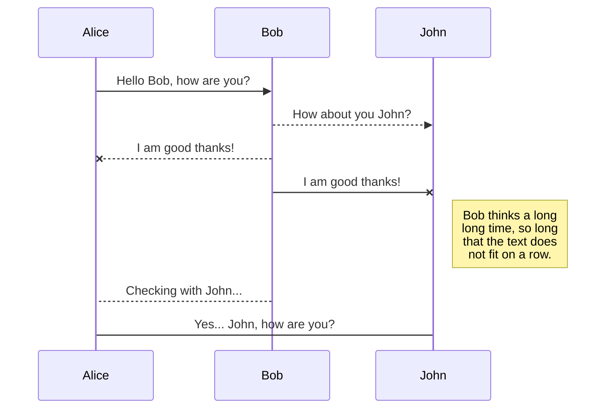
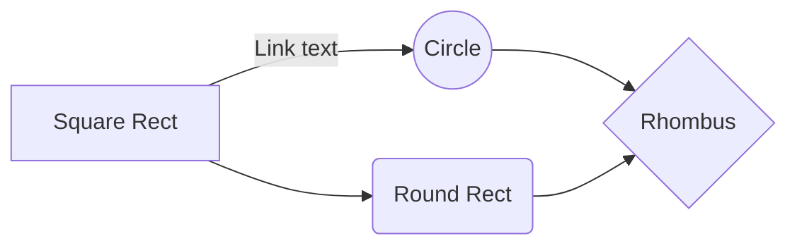

# Google Camera Port

A download page for some of the Google Camera mods. From devs like BSG, Arnova8G2, and many others.

## Downloads
### Suggested Versions: 
-   [**Arnova's v8.3b1**](https://www.celsoazevedo.com/files/android/google-camera/dev-arnova8G2/#apk411): a pixel-like experience and no config needed. Doesn't require a camera fix anymore on some phones.
-   [**Arnova's v7beta9**](https://www.celsoazevedo.com/files/android/google-camera/dev-arnova8G2/#apk195): similar to Arnova's v8.2. Use if you have issues with v8.2.
-   [**Old suggested versions**](https://www.celsoazevedo.com/files/android/google-camera/dev-suggested/): page with all versions I've suggested before.

-   [MGC_6.1.021_RP1_V1.2.0B.apk](https://f.celsoazevedo.com/file/gcamera/MGC_6.1.021_RP1_V1.2.0B.apk)  (HomerSp, 2018-12-21,  Razer 1,  [changelog](https://forum.xda-developers.com/razer-phone/themes/apk-google-camera-6-1-021-modded-t3880003))
-   [MGC_6.1.021_RP1_V1.0.0T.apk](https://f.celsoazevedo.com/file/gcamera/MGC_6.1.021_RP1_V1.0.0T.apk)  (HomerSp, 2018-12-21,  Razer 1,  [changelog](https://forum.xda-developers.com/razer-phone/themes/apk-google-camera-6-1-021-modded-t3880003))
-   [MGC_6.1.021_Potter_v6Fsan1ty.apk](https://f.celsoazevedo.com/file/gcamera/MGC_6.1.021_Potter_v6Fsan1ty.apk)  (san1ty, 2019-01-13,  [changelog](https://www.celsoazevedo.com/files/android/google-camera/f/changelog337/))
-   [MGC_6.1.021_BSG_Arnova-TlnNeun_Urnyx05-v3.3.apk](https://f.celsoazevedo.com/file/gcamera/MGC_6.1.021_BSG_Arnova-TlnNeun_Urnyx05-v3.3.apk)  (Urnyx05, 2019-01-13,  OP5/5T,  [changelog](https://forum.xda-developers.com/showpost.php?p=78669175&postcount=4539))
-   [MGC_6.1.021_BSG_Arnova-based_v.1.3c_fix_TlnNeun_xcam_5_beta6.apk](https://f.celsoazevedo.com/file/gcamera/MGC_6.1.021_BSG_Arnova-based_v.1.3c_fix_TlnNeun_xcam_5_beta6.apk)  (xtrme, 2019-01-11,  [changelog](https://www.celsoazevedo.com/files/android/google-camera/f/changelog334/))
-   [MGC_6.1.021_BSG_Arnova-based_v.1.3d_TlnNeun_Urnyx05-v3.0.apk](https://f.celsoazevedo.com/file/gcamera/MGC_6.1.021_BSG_Arnova-based_v.1.3d_TlnNeun_Urnyx05-v3.0.apk)  (Urnyx05, 2019-01-08,  OP5/5T,  [changelog](https://forum.xda-developers.com/showpost.php?p=78624220&postcount=4501))
-   [MGC_6.1.021_BSG_Arnova-based_v.1.3c_fix_TlnNeun_xcam_5_beta5.apk](https://f.celsoazevedo.com/file/gcamera/MGC_6.1.021_BSG_Arnova-based_v.1.3c_fix_TlnNeun_xcam_5_beta5.apk)  (xtrme, 2019-01-08,  [changelog](https://www.celsoazevedo.com/files/android/google-camera/f/changelog331/))
-   [GCam_6.1.021_N7P_test2.1_defaultjpg.apk](https://f.celsoazevedo.com/file/gcamera/GCam_6.1.021_N7P_test2.1_defaultjpg.apk)  (back.rider, 2019-01-04,  [changelog](https://forum.xda-developers.com/showpost.php?p=78585931&postcount=1586))
-   [MGC_6.1.021_F1_V2b_plus3.apk](https://f.celsoazevedo.com/file/gcamera/MGC_6.1.021_F1_V2b_plus3.apk)  (san1ty, 2019-01-06,  [changelog](https://www.celsoazevedo.com/files/android/google-camera/f/changelog328/))
-   [CaMMera_3.2.045_A6.0.apk](https://f.celsoazevedo.com/file/gcamera/CaMMera_3.2.045_A6.0.apk)  (harysviewty, 2019-01-05,  [changelog](https://www.celsoazevedo.com/files/android/google-camera/f/changelog327/))
-   [GoogleCamera_5.2.025-Final_fu24-17f.apk](https://f.celsoazevedo.com/file/gcamera/GoogleCamera_5.2.025-Final_fu24-17f.apk)  (fu24, 2019-01-03,  normal/wide angle,  [changelog](https://forum.xda-developers.com/showpost.php?p=78578487&postcount=156))
-   [GoogleCamera_5.2.025-Final_fu24-17f_845Colorfix.apk](https://f.celsoazevedo.com/file/gcamera/GoogleCamera_5.2.025-Final_fu24-17f_845Colorfix.apk)  (fu24, 2019-01-03,  normal/wide angle,  [changelog](https://forum.xda-developers.com/showpost.php?p=78578487&postcount=156))
-   [G4Camera_2019.apk](https://f.celsoazevedo.com/file/gcamera/G4Camera_2019.apk)  (harysviewty, 2019-01-02,  [changelog](https://www.celsoazevedo.com/files/android/google-camera/f/changelog326/))
-   [GCam_6.1.021_N7P_test2.1.apk](https://f.celsoazevedo.com/file/gcamera/GCam_6.1.021_N7P_test2.1.apk)  (back.rider, 2019-01-02,  [changelog](https://forum.xda-developers.com/showpost.php?p=78572654&postcount=1569))
-   [GCam_v.5.1.0.18_mod_v.3.4.17.apk](https://f.celsoazevedo.com/file/gcamera/GCam_v.5.1.0.18_mod_v.3.4.17.apk)  (arthur, 2018-12-31,  [changelog](https://www.celsoazevedo.com/files/android/google-camera/f/changelog325/))
-   **[MGC_6.1.021_BSG_Arnova-based_v.1.3d_TlnNeun_2.apk](https://f.celsoazevedo.com/file/gcamera/MGC_6.1.021_BSG_Arnova-based_v.1.3d_TlnNeun_2.apk)  (Arnova8G2, 2018-12-30,  [changelog](https://www.celsoazevedo.com/files/android/google-camera/f/changelog324/))**
-   **[MGC_6.1.021_MI8_V2b_plus3.apk](https://f.celsoazevedo.com/file/gcamera/MGC_6.1.021_MI8_V2b_plus3.apk)  (BSG, 2018-12-30,  [changelog](https://www.celsoazevedo.com/files/android/google-camera/f/changelog323/))**
-   [GCam_6.1.021_N7P_test2.apk](https://f.celsoazevedo.com/file/gcamera/GCam_6.1.021_N7P_test2.apk)  (back.rider, 2018-12-30,  [changelog](https://forum.xda-developers.com/showpost.php?p=78549814&postcount=1544))
-   [MGC_6.1.021_BSG_Arnova_TlnNeun_1.2_san1tymodF1.apk](https://f.celsoazevedo.com/file/gcamera/MGC_6.1.021_BSG_Arnova_TlnNeun_1.2_san1tymodF1.apk)  (san1ty, 2018-12-30,  [changelog](https://www.celsoazevedo.com/files/android/google-camera/f/changelog322/))
-   **[MGC_6.1.021_MI8_V2b_plus.apk](https://f.celsoazevedo.com/file/gcamera/MGC_6.1.021_MI8_V2b_plus.apk)  (BSG, 2018-12-30,  [changelog](https://www.celsoazevedo.com/files/android/google-camera/f/changelog321/))**
-   [LGN2_MGC_6.1.021_MI8_V1d.apk](https://f.celsoazevedo.com/file/gcamera/LGN2_MGC_6.1.021_MI8_V1d.apk)  (cstark27, 2018-12-28,  normal angle,  [changelog](https://forum.xda-developers.com/showpost.php?p=78530683&postcount=2038))
-   [LGW2_MGC_6.1.021_MI8_V1d.apk](https://f.celsoazevedo.com/file/gcamera/LGW2_MGC_6.1.021_MI8_V1d.apk)  (cstark27, 2018-12-28,  wide angle,  [changelog](https://forum.xda-developers.com/showpost.php?p=78530683&postcount=2038))
-   [LGN2_bsg-test-8.1.apk](https://f.celsoazevedo.com/file/gcamera/LGN2_bsg-test-8.1.apk)  (cstark27, 2018-12-28,  normal angle,  [changelog](https://forum.xda-developers.com/showpost.php?p=78530683&postcount=2038))
-   [LGW2_bsg-test-8.1.apk](https://f.celsoazevedo.com/file/gcamera/LGW2_bsg-test-8.1.apk)  (cstark27, 2018-12-28,  wide angle,  [changelog](https://forum.xda-developers.com/showpost.php?p=78530683&postcount=2038))
-   [NoHex_MGC_6.1.021_MI8_V2a.apk](https://f.celsoazevedo.com/file/gcamera/NoHex_MGC_6.1.021_MI8_V2a.apk)  (cstark27, 2018-12-28,  normal/wide angle,  [changelog](https://forum.xda-developers.com/showpost.php?p=78530683&postcount=2038))
-   [MGC_6.1.021_Potter_v6slidertest-san1ty.apk](https://f.celsoazevedo.com/file/gcamera/MGC_6.1.021_Potter_v6slidertest-san1ty.apk)  (san1ty, 2018-12-28,  potter,  [changelog](https://www.celsoazevedo.com/files/android/google-camera/f/changelog320/))
-   [MGC_6.1.021_BSG_Arnova-based_v.1.3d_TlnNeun.apk](https://f.celsoazevedo.com/file/gcamera/MGC_6.1.021_BSG_Arnova-based_v.1.3d_TlnNeun.apk)  (Tolyan009, 2018-12-26,  [changelog](https://www.celsoazevedo.com/files/android/google-camera/f/changelog319/))
-   [GCam_5.1.018.177470874.41362666_IDan_N6_4.1_fix.apk](https://f.celsoazevedo.com/file/gcamera/GCam_5.1.018.177470874.41362666_IDan_N6_4.1_fix.apk)  (IDan, 2018-12-26,  exynos,  one ui,  [changelog](https://forum.xda-developers.com/showpost.php?p=78518998&postcount=250))
-   [GCam_5.1.018.177470874.41362666_IDan_N6_3.5_fix.apk](https://f.celsoazevedo.com/file/gcamera/GCam_5.1.018.177470874.41362666_IDan_N6_3.5_fix.apk)  (IDan, 2018-12-26,  exynos,  one ui,  [changelog](https://forum.xda-developers.com/showpost.php?p=78518998&postcount=250))
-   [GCam_6.1.021_N7P_test1.3.apk](https://f.celsoazevedo.com/file/gcamera/GCam_6.1.021_N7P_test1.3.apk)  (back.rider, 2018-12-25,  [changelog](https://forum.xda-developers.com/showpost.php?p=78508302&postcount=1500))
-   [MGC_6.1.021_Potter_v6-san1ty.apk](https://f.celsoazevedo.com/file/gcamera/MGC_6.1.021_Potter_v6-san1ty.apk)  (san1ty, 2018-12-24,  potter,  [changelog](https://www.celsoazevedo.com/files/android/google-camera/f/changelog318/))
-   [MGC_6.1.021_v.1.2_TlnNeun_Fix-Urnyx05-v2.2.apk](https://f.celsoazevedo.com/file/gcamera/MGC_6.1.021_v.1.2_TlnNeun_Fix-Urnyx05-v2.2.apk)  (Urnyx05, 2018-12-24,  OP5/5T,  [changelog](https://forum.xda-developers.com/showpost.php?p=78501324&postcount=4432))
-   [MGC_6.1.021_BSG_Arnova-based_v.1.3c_fix_TlnNeun.apk](https://f.celsoazevedo.com/file/gcamera/MGC_6.1.021_BSG_Arnova-based_v.1.3c_fix_TlnNeun.apk)  (Tolyan009, 2018-12-23,  [changelog](https://www.celsoazevedo.com/files/android/google-camera/f/changelog317/))
-   [P3v9.1_GoogleCamera_6.1.021.apk](https://f.celsoazevedo.com/file/gcamera/P3v9.1_GoogleCamera_6.1.021.apk)  (cstark27, 2018-12-23,  Pixel 1/2/3,  [changelog](https://forum.xda-developers.com/showpost.php?p=78490139&postcount=186))
-   [MGC_6.1.021_MI8_V2a+.apk](https://f.celsoazevedo.com/file/gcamera/MGC_6.1.021_MI8_V2a+.apk)  (BSG, 2018-12-21,  normal/wide angle,  [changelog](https://www.celsoazevedo.com/files/android/google-camera/f/changelog316/))
-   [MGC_6.1.021_MI8_V2a.apk](https://f.celsoazevedo.com/file/gcamera/MGC_6.1.021_MI8_V2a.apk)  (BSG, 2018-12-21,  normal/wide angle,  [changelog](https://www.celsoazevedo.com/files/android/google-camera/f/changelog315/))
-   [MGC_6.1.021_BSG_Arnova_TlnNeun_1.2_test_fix_Exynos.apk](https://f.celsoazevedo.com/file/gcamera/MGC_6.1.021_BSG_Arnova_TlnNeun_1.2_test_fix_Exynos.apk)  (Arnova8G2, 2018-12-21,  Exynos,  Kirin,  [changelog](https://forum.xda-developers.com/showpost.php?p=78477944&postcount=770))
-   [P3v9_GoogleCamera_6.1.021.apk](https://f.celsoazevedo.com/file/gcamera/P3v9_GoogleCamera_6.1.021.apk)  (cstark27, 2018-12-21,  Pixel 1/2/3,  [changelog](https://forum.xda-developers.com/showpost.php?p=78477944&postcount=770))
-   [MGC_6.1.021_BSG_Arnova_TlnNeun_1.2_Final_Fix3_Exynos.apk](https://f.celsoazevedo.com/file/gcamera/MGC_6.1.021_BSG_Arnova_TlnNeun_1.2_Final_Fix3_Exynos.apk)  (Arnova8G2, 2018-12-20,  Exynos,  Kirin,  [changelog](https://forum.xda-developers.com/showpost.php?p=78473834&postcount=732))
-   [MGC_6.1.021_BSG_Arnova_TlnNeun_1.2_Final_Fix2_Exynos.apk](https://f.celsoazevedo.com/file/gcamera/MGC_6.1.021_BSG_Arnova_TlnNeun_1.2_Final_Fix2_Exynos.apk)  (Arnova8G2, 2018-12-20,  Exynos,  Kirin,  [changelog](https://forum.xda-developers.com/showpost.php?p=78473742&postcount=729))
-   [MGC_6.1.021_BSG_Arnova_TlnNeun_1.2_Final_Fix_Exynos_kirin.apk](https://f.celsoazevedo.com/file/gcamera/MGC_6.1.021_BSG_Arnova_TlnNeun_1.2_Final_Fix_Exynos_kirin.apk)  (Arnova8G2, 2018-12-20,  Exynos,  Kirin,  [changelog](https://forum.xda-developers.com/showpost.php?p=78473513&postcount=722))
-   [MGC_6.1.021_BSG_Arnova_TlnNeun_1.2_Final.apk](https://f.celsoazevedo.com/file/gcamera/MGC_6.1.021_BSG_Arnova_TlnNeun_1.2_Final.apk)  (Arnova8G2, 2018-12-20,  [changelog](https://forum.xda-developers.com/showpost.php?p=78472914&postcount=705))
-   [MGC_6.1.021_BSG_Arnova-based_v.1.3a_fix_TlnNeun.apk](https://f.celsoazevedo.com/file/gcamera/MGC_6.1.021_BSG_Arnova-based_v.1.3a_fix_TlnNeun.apk)  (Tolyan009, 2018-12-20,  [changelog](https://www.celsoazevedo.com/files/android/google-camera/f/changelog314/))
-   [MGC_6.1.021_BSG_Arnova-based_v.1.3_TlnNeun.apk](https://f.celsoazevedo.com/file/gcamera/MGC_6.1.021_BSG_Arnova-based_v.1.3_TlnNeun.apk)  (Tolyan009, 2018-12-20,  [changelog](https://www.celsoazevedo.com/files/android/google-camera/f/changelog313/))
-   [MGC_6.1.021_v.1.2_TlnNeun_Fix-Urnyx05-v2.0.apk](https://f.celsoazevedo.com/file/gcamera/MGC_6.1.021_v.1.2_TlnNeun_Fix-Urnyx05-v2.0.apk)  (Urnyx05, 2018-12-19,  OP5/5T,  [changelog](https://forum.xda-developers.com/showpost.php?p=78465446&postcount=4382))
-   [Camera_6.1.013.216795316.apk](https://f.celsoazevedo.com/file/gcamera/Camera_6.1.013.216795316.apk)  (kokroo, 2018-12-18,  [changelog](https://www.celsoazevedo.com/files/android/google-camera/f/changelog312/))
-   **[MGC_6.1.021_MI8_V2.apk](https://f.celsoazevedo.com/file/gcamera/MGC_6.1.021_MI8_V2.apk)  (BSG, 2018-12-19,  [changelog](https://www.celsoazevedo.com/files/android/google-camera/f/changelog311/))**
-   [MGC_6.1.021_MI8_V1h.apk](https://f.celsoazevedo.com/file/gcamera/MGC_6.1.021_MI8_V1h.apk)  (BSG, 2018-12-19,  [changelog](https://www.celsoazevedo.com/files/android/google-camera/f/changelog310/))
-   [MGC_6.1.021_BSG_Arnova-based_v.1.2_TlnNeun_xcam_0.apk](https://f.celsoazevedo.com/file/gcamera/MGC_6.1.021_BSG_Arnova-based_v.1.2_TlnNeun_xcam_0.apk)  (xtrme, 2018-12-19,  [changelog](https://www.celsoazevedo.com/files/android/google-camera/f/changelog309/))
-   [MGC_6.1.021_MI8_V1d_fu24-01g.apk](https://f.celsoazevedo.com/file/gcamera/MGC_6.1.021_MI8_V1d_fu24-01g.apk)  (fu24, 2018-12-19,  normal/wide angle,  [changelog](https://forum.xda-developers.com/showpost.php?p=78460761&postcount=129))
-   [GoogleCamera_5.2.025-Final_fu24-17_845Colorfix.apk](https://f.celsoazevedo.com/file/gcamera/GoogleCamera_5.2.025-Final_fu24-17_845Colorfix.apk)  (fu24, 2018-12-19,  normal/wide angle,  [changelog](https://forum.xda-developers.com/showpost.php?p=78460349&postcount=99))
-   [GCam_6.1.021_N7P_test1.2.apk](https://f.celsoazevedo.com/file/gcamera/GCam_6.1.021_N7P_test1.2.apk)  (back.rider, 2018-12-19,  [changelog](https://forum.xda-developers.com/showpost.php?p=78460065&postcount=1431))
-   **[MGC_6.1.021_BSG_Arnova-based_v.1.2_TlnNeun_Fix.apk](https://f.celsoazevedo.com/file/gcamera/MGC_6.1.021_BSG_Arnova-based_v.1.2_TlnNeun_Fix.apk)  (Arnova8G2, 2018-12-18,  [changelog](https://forum.xda-developers.com/showpost.php?p=78454793&postcount=656))**
-   [GCam_6.1.021_N7P_test1.1.apk](https://f.celsoazevedo.com/file/gcamera/GCam_6.1.021_N7P_test1.1.apk)  (back.rider, 2018-12-17,  [changelog](https://forum.xda-developers.com/showpost.php?p=78446311&postcount=1419))
-   [GCam_6.1.021_test1.apk](https://f.celsoazevedo.com/file/gcamera/GCam_6.1.021_test1.apk)  (back.rider, 2018-12-16,  [changelog](https://forum.xda-developers.com/showpost.php?p=78436854&postcount=1410))
-   [P3v8.6_GoogleCamera_6.1.021.apk](https://f.celsoazevedo.com/file/gcamera/P3v8.6_GoogleCamera_6.1.021.apk)  (cstark27, 2018-12-18,  Pixel 1/2/3,  [changelog](https://forum.xda-developers.com/showpost.php?p=78452456&postcount=115))
-   [MGC_6.1.021_MI8_Vbad.apk](https://f.celsoazevedo.com/file/gcamera/MGC_6.1.021_MI8_Vbad.apk)  (BSG, 2018-12-18,  normal/wide angle,  [changelog](https://www.celsoazevedo.com/files/android/google-camera/f/changelog308/))
-   [MGC_6.1.021_MI8_V1g.apk](https://f.celsoazevedo.com/file/gcamera/MGC_6.1.021_MI8_V1g.apk)  (BSG, 2018-12-17,  [changelog](https://www.celsoazevedo.com/files/android/google-camera/f/changelog306/))
-   [MGC_6.1.021_MI8_V1f.apk](https://f.celsoazevedo.com/file/gcamera/MGC_6.1.021_MI8_V1f.apk)  (BSG, 2018-12-16,  [changelog](https://www.celsoazevedo.com/files/android/google-camera/f/changelog305/))
-   [MGC_6.1.021_MI8_V1e.apk](https://f.celsoazevedo.com/file/gcamera/MGC_6.1.021_MI8_V1e.apk)  (BSG, 2018-12-16,  [changelog](https://www.celsoazevedo.com/files/android/google-camera/f/changelog304/))
-   **[MGC_6.1.021_BSG_Arnova-based_v.1.2_TlnNeun.apk](https://f.celsoazevedo.com/file/gcamera/MGC_6.1.021_BSG_Arnova-based_v.1.2_TlnNeun.apk)  (Tolyan009, 2018-12-17,  [changelog](https://www.celsoazevedo.com/files/android/google-camera/f/changelog303/))**
-   [LGN1_MGC_6.1.021_MI8_V1d.apk](https://f.celsoazevedo.com/file/gcamera/LGN1_MGC_6.1.021_MI8_V1d.apk)  (cstark27, 2018-12-15,  normal,  [changelog](https://forum.xda-developers.com/showpost.php?p=78435063&postcount=1932))
-   [LGW1_MGC_6.1.021_MI8_V1d.apk](https://f.celsoazevedo.com/file/gcamera/LGW1_MGC_6.1.021_MI8_V1d.apk)  (cstark27, 2018-12-15,  wide,  [changelog](https://forum.xda-developers.com/showpost.php?p=78435063&postcount=1932))
-   [LGN1_bsg-test-8.1.apk](https://f.celsoazevedo.com/file/gcamera/LGN1_bsg-test-8.1.apk)  (cstark27, 2018-12-15,  normal,  [changelog](https://forum.xda-developers.com/showpost.php?p=78435063&postcount=1932))
-   [LGNW1_bsg-test-8.1.apk](https://f.celsoazevedo.com/file/gcamera/LGNW1_bsg-test-8.1.apk)  (cstark27, 2018-12-15,  wide,  [changelog](https://forum.xda-developers.com/showpost.php?p=78435063&postcount=1932))
-   [MGC_6.1.021_BSG_Arnova-based_v.1.1_TlnNeun_xcam_1.apk](https://f.celsoazevedo.com/file/gcamera/MGC_6.1.021_BSG_Arnova-based_v.1.1_TlnNeun_xcam_1.apk)  (xtrme, 2018-12-15,  [changelog](https://www.celsoazevedo.com/files/android/google-camera/f/changelog302/))
-   [P3v8.5_GoogleCamera_6.1.021.apk](https://f.celsoazevedo.com/file/gcamera/P3v8.5_GoogleCamera_6.1.021.apk)  (cstark27, 2018-12-15,  Pixel 1/2/3,  [changelog](https://forum.xda-developers.com/showpost.php?p=78429730&postcount=79))
-   [MGC_6.1.021_MI8_V1d_fu24-01f.apk](https://f.celsoazevedo.com/file/gcamera/MGC_6.1.021_MI8_V1d_fu24-01f.apk)  (fu24, 2018-12-13,  normal/wide angle,  [changelog](https://forum.xda-developers.com/showpost.php?p=78413652&postcount=97))
-   [LGN_MGC_6.1.021_Potter_v4F-san1ty-final.apk](https://f.celsoazevedo.com/file/gcamera/LGN_MGC_6.1.021_Potter_v4F-san1ty-final.apk)  (cstark27, 2018-12-12,  [changelog](https://forum.xda-developers.com/showpost.php?p=78403177&postcount=1854))
-   **[MGC_6.1.021_BSG_Arnova-based_v.1.1_TlnNeun.apk](https://f.celsoazevedo.com/file/gcamera/MGC_6.1.021_BSG_Arnova-based_v.1.1_TlnNeun.apk)  (Tolyan009, 2018-12-11,  [changelog](https://www.celsoazevedo.com/files/android/google-camera/f/changelog301/))**
-   [P3v8_GoogleCamera_6.1.021.apk](https://f.celsoazevedo.com/file/gcamera/P3v8_GoogleCamera_6.1.021.apk)  (cstark27, 2018-12-05,  Pixel 1/2/3,  [changelog](https://forum.xda-developers.com/apps/google-camera-mods/gcam-google-pixel-1-2-3-t3875663))
-   [MGC_6.1.021_BSG_Arnova-based_v.1.0_OP6test2_TlnNeun.apk.apk](https://f.celsoazevedo.com/file/gcamera/MGC_6.1.021_BSG_Arnova-based_v.1.0_OP6test2_TlnNeun.apk.apk)  (Tolyan009, 2018-12-10,  [changelog](https://www.celsoazevedo.com/files/android/google-camera/f/changelog300/))
-   [MGC_6.1.021_BSG_Arnova-based_v.1.0_TlnNeun.apk](https://f.celsoazevedo.com/file/gcamera/MGC_6.1.021_BSG_Arnova-based_v.1.0_TlnNeun.apk)  (Tolyan009, 2018-12-10,  [changelog](https://www.celsoazevedo.com/files/android/google-camera/f/changelog299/))
-   [GoogleCamera_6.1.021.220943556.apk](https://f.celsoazevedo.com/file/gcamera/GoogleCamera_6.1.021.220943556.apk)  (Arnova8G2, 2018-12-09,  [changelog](https://forum.xda-developers.com/showpost.php?p=78378706&postcount=516))
-   [MGC_6.1.021_V1d-Advances_test2.apk](https://f.celsoazevedo.com/file/gcamera/MGC_6.1.021_V1d-Advances_test2.apk)  (Arnova8G2, 2018-12-08,  [changelog](https://forum.xda-developers.com/showpost.php?p=78375830&postcount=501))
-   [MGC_6.1.021_V1d-Advances_test1.apk](https://f.celsoazevedo.com/file/gcamera/MGC_6.1.021_V1d-Advances_test1.apk)  (Arnova8G2, 2018-12-08,  [changelog](https://forum.xda-developers.com/showpost.php?p=78375602&postcount=499))
-   [MGC_6.1.009_Poco-oreo_san1ty.apk](https://f.celsoazevedo.com/file/gcamera/MGC_6.1.009_Poco-oreo_san1ty.apk)  (san1ty, 2018-12-08,  poco f1,  [changelog](https://www.celsoazevedo.com/files/android/google-camera/f/changelog298/))
-   [MGC_6.1.021_MI8_V1d.apk](https://f.celsoazevedo.com/file/gcamera/MGC_6.1.021_MI8_V1d.apk)  (BSG, 2018-12-05,  [changelog](https://www.celsoazevedo.com/files/android/google-camera/f/changelog297/))
-   [GCam_v.5.1.0.18_mod_v.3.4.16.apk](https://f.celsoazevedo.com/file/gcamera/GCam_v.5.1.0.18_mod_v.3.4.16.apk)  (arthur, 2018-12-05,  [changelog](https://www.celsoazevedo.com/files/android/google-camera/f/changelog296/))
-   [MGC_6.1.021_B-S-G-based_v.0.1_TlnNeun.apk](https://f.celsoazevedo.com/file/gcamera/MGC_6.1.021_B-S-G-based_v.0.1_TlnNeun.apk)  (Tolyan009, 2018-12-04,  [changelog](https://www.celsoazevedo.com/files/android/google-camera/f/changelog295/))
-   [MGC_6.1.013_B-S-G-based_v.0.6b_TlnNeun.apk](https://f.celsoazevedo.com/file/gcamera/MGC_6.1.013_B-S-G-based_v.0.6b_TlnNeun.apk)  (Tolyan009, 2018-12-03,  [changelog](https://www.celsoazevedo.com/files/android/google-camera/f/changelog294/))
-   [MGC_6.1.021_Potter_v5F-san1ty.apk](https://f.celsoazevedo.com/file/gcamera/MGC_6.1.021_Potter_v5F-san1ty.apk)  (san1ty, 2018-12-03,  potter,  [changelog](https://t.me/G5PlusMods/304))
-   [MGC_6.1.013_B-S-G-based_v.0.5_TlnNeun.apk](https://f.celsoazevedo.com/file/gcamera/MGC_6.1.013_B-S-G-based_v.0.5_TlnNeun.apk)  (Tolyan009, 2018-12-02,  [changelog](https://www.celsoazevedo.com/files/android/google-camera/f/changelog293/))
-   [MGC_6.1.021_MI8_Vc.apk](https://f.celsoazevedo.com/file/gcamera/MGC_6.1.021_MI8_Vc.apk)  (BSG, 2018-12-02,  [changelog](https://www.celsoazevedo.com/files/android/google-camera/f/changelog292/))
-   [MGC_6.1.021_MI8_V1b.apk](https://f.celsoazevedo.com/file/gcamera/MGC_6.1.021_MI8_V1b.apk)  (BSG, 2018-12-01,  [changelog](https://www.celsoazevedo.com/files/android/google-camera/f/changelog291/))
-   [GoogleCamera_5.2.025-Final_fu24-17.apk](https://f.celsoazevedo.com/file/gcamera/GoogleCamera_5.2.025-Final_fu24-17.apk)  (fu24, 2018-11-30,  normal/wide angle,  [changelog](https://forum.xda-developers.com/showpost.php?p=78296718&postcount=52))
-   [MGC_6.1.021_MI8_V1a_Fu24-0.apk](https://f.celsoazevedo.com/file/gcamera/MGC_6.1.021_MI8_V1a_Fu24-0.apk)  (fu24, 2018-11-29,  [changelog](https://forum.xda-developers.com/showpost.php?p=78288728&postcount=45))
-   [GCam_5.3.015-Pixel3Mod-Arnova8G2-1.4_OP6T.apk](https://f.celsoazevedo.com/file/gcamera/GCam_5.3.015-Pixel3Mod-Arnova8G2-1.4_OP6T.apk)  (cstark27, 2018-11-29,  [changelog](https://www.celsoazevedo.com/files/android/google-camera/f/changelog290/))
-   [GCam-5.1.018-Pixel2Mod-Arnova8G2-V8.3bfix_OP6T.apk](https://f.celsoazevedo.com/file/gcamera/GCam-5.1.018-Pixel2Mod-Arnova8G2-V8.3bfix_OP6T.apk)  (cstark27, 2018-11-29,  [changelog](https://www.celsoazevedo.com/files/android/google-camera/f/changelog290/))
-   [GCam-5.1.018-SerJo87-1.6RC3-Oneplus-Urnyx05-eszdman-gamma-v1.0.apk](https://f.celsoazevedo.com/file/gcamera/GCam-5.1.018-SerJo87-1.6RC3-Oneplus-Urnyx05-eszdman-gamma-v1.0.apk)  (Urnyx05, 2018-11-28,  OP5/5T,  [changelog](https://forum.xda-developers.com/showpost.php?p=78282234&postcount=4283))
-   [GCam_5_1_018_SerJo87_1_6RC3_Oneplus-Urnyx05-original-gamma-v1.0.apk](https://f.celsoazevedo.com/file/gcamera/GCam_5_1_018_SerJo87_1_6RC3_Oneplus-Urnyx05-original-gamma-v1.0.apk)  (Urnyx05, 2018-11-28,  OP5/5T,  [changelog](https://forum.xda-developers.com/showpost.php?p=78282234&postcount=4283))
-   [bsg-test-8.1.apk](https://f.celsoazevedo.com/file/gcamera/bsg-test-8.1.apk)  (BSG, 2018-11-27,  [changelog](https://www.celsoazevedo.com/files/android/google-camera/f/changelog289/))
-   [GCam_Pixel3Mod_1.3_build.6.1.021.apk](https://f.celsoazevedo.com/file/gcamera/GCam_Pixel3Mod_1.3_build.6.1.021.apk)  (Arnova8G2, 2018-11-27,  [changelog](https://forum.xda-developers.com/showpost.php?p=78273922&postcount=376))
-   [SerJo87-1.6RC3-Oneplus-with-icons-eszdman-gamma.apk](https://f.celsoazevedo.com/file/gcamera/SerJo87-1.6RC3-Oneplus-with-icons-eszdman-gamma.apk)  (Urnyx05, 2018-11-25,  OP5/5T,  [changelog](https://forum.xda-developers.com/showpost.php?p=78255068&postcount=4251))
-   [SerJo87-1.6RC3-Oneplus-with-icons-original-gamma.apk](https://f.celsoazevedo.com/file/gcamera/SerJo87-1.6RC3-Oneplus-with-icons-original-gamma.apk)  (Urnyx05, 2018-11-25,  OP5/5T,  [changelog](https://forum.xda-developers.com/showpost.php?p=78255068&postcount=4251))
-   [GCam_5.1.018_by_SerJo87_1.6RC3_test1_pre-Release_ewg-FixOneplus.apk](https://f.celsoazevedo.com/file/gcamera/GCam_5.1.018_by_SerJo87_1.6RC3_test1_pre-Release_ewg-FixOneplus.apk)  (Urnyx05, 2018-11-24,  OP5/5T,  [changelog](https://forum.xda-developers.com/showpost.php?p=78245891&postcount=4245))
-   [MGC_6.1.009__Potter-final.apk](https://f.celsoazevedo.com/file/gcamera/MGC_6.1.009__Potter-final.apk)  (san1ty, 2018-11-19,  potter,  [changelog](https://t.me/G5PlusMods/247))
-   [GoogleCamera32bit_2018-08-10.apk](https://f.celsoazevedo.com/file/gcamera/GoogleCamera32bit_2018-08-10.apk)  (savitar, 2018-08-10,  32 bit,  potter,  [changelog](https://t.me/G5PlusMods/243))
-   [MGC_6.1.021_MI8_V1a_xcam_0.apk](https://f.celsoazevedo.com/file/gcamera/MGC_6.1.021_MI8_V1a_xcam_0.apk)  (xtrme, 2018-11-23,  [changelog](https://www.celsoazevedo.com/files/android/google-camera/f/changelog288/))
-   [cstark27_GCam_5.1.018_24_v4.2t3_fu24-05h.apk](https://f.celsoazevedo.com/file/gcamera/cstark27_GCam_5.1.018_24_v4.2t3_fu24-05h.apk)  (fu24, 2018-11-23,  normal/wide angle,  [changelog](https://forum.xda-developers.com/showpost.php?p=78237947&postcount=1799))
-   [cstark27_GCam_5.1.018_24_v4.2t3_fu24-05g.apk](https://f.celsoazevedo.com/file/gcamera/cstark27_GCam_5.1.018_24_v4.2t3_fu24-05g.apk)  (fu24, 2018-11-23,  normal/wide angle,  [changelog](https://forum.xda-developers.com/showpost.php?p=78237947&postcount=1799))
-   [MGC_6.1.021_MI8_V1a.apk](https://f.celsoazevedo.com/file/gcamera/MGC_6.1.021_MI8_V1a.apk)  (BSG, 2018-11-21,  [changelog](https://www.celsoazevedo.com/files/android/google-camera/f/changelog287/))
-   [Urnyx05-v6.2.apk](https://f.celsoazevedo.com/file/gcamera/Urnyx05-v6.2.apk)  (Urnyx05, 2018-11-21,  OP5/5T,  [changelog](https://forum.xda-developers.com/showpost.php?p=78224385&postcount=4217))
-   [Urnyx05-v6.2-manual.apk](https://f.celsoazevedo.com/file/gcamera/Urnyx05-v6.2-manual.apk)  (Urnyx05, 2018-11-21,  OP5/5T,  manual focus,  [changelog](https://forum.xda-developers.com/showpost.php?p=78224385&postcount=4217))
-   [MGC_6.1.021_FINAL_V1b_A8.1+.apk](https://f.celsoazevedo.com/file/gcamera/MGC_6.1.021_FINAL_V1b_A8.1+.apk)  (BSG, 2018-11-21,  [changelog](https://www.celsoazevedo.com/files/android/google-camera/f/changelog286/))
-   [MGC_6.1.021_FINAL_V1a_A8.1+.apk](https://f.celsoazevedo.com/file/gcamera/MGC_6.1.021_FINAL_V1a_A8.1+.apk)  (BSG, 2018-11-20,  [changelog](https://www.celsoazevedo.com/files/android/google-camera/f/changelog285/))
-   [GCam_Pixel3Mod_1.3beta_build.6.1.0210.apk](https://f.celsoazevedo.com/file/gcamera/GCam_Pixel3Mod_1.3beta_build.6.1.0210.apk)  (Arnova8G2, 2018-11-20,  [changelog](https://forum.xda-developers.com/showpost.php?p=78212734&postcount=283))
-   [GCam_Pixel3Mod_1.2beta_build.6.1.013.apk](https://f.celsoazevedo.com/file/gcamera/GCam_Pixel3Mod_1.2beta_build.6.1.013.apk)  (Arnova8G2, 2018-11-20,  [changelog](https://forum.xda-developers.com/showpost.php?p=78212734&postcount=283))
-   [MGC_6.1.013_TlnNeun-based_v.0.4_IDan-Advances+.apk](https://f.celsoazevedo.com/file/gcamera/MGC_6.1.013_TlnNeun-based_v.0.4_IDan-Advances+.apk)  (Arnova8G2, 2018-11-20,  [changelog](https://forum.xda-developers.com/showpost.php?p=78212734&postcount=283))
-   [MGC_6.1.021_FINAL_V1_A8.1+.apk](https://f.celsoazevedo.com/file/gcamera/MGC_6.1.021_FINAL_V1_A8.1+.apk)  (BSG, 2018-11-20,  [changelog](https://www.celsoazevedo.com/files/android/google-camera/f/changelog284/))
-   [MGC_6.1.013_TlnNeun-based_v.0.4_IDan.apk](https://f.celsoazevedo.com/file/gcamera/MGC_6.1.013_TlnNeun-based_v.0.4_IDan.apk)  (IDan, 2018-11-17,  [changelog](https://forum.xda-developers.com/showpost.php?p=78185672&postcount=454))
-   [P3v7_GoogleCamera_6.1.021.apk](https://f.celsoazevedo.com/file/gcamera/P3v7_GoogleCamera_6.1.021.apk)  (cstark27, 2018-11-17,  Pixel 2/3,  [changelog](https://forum.xda-developers.com/showpost.php?p=78183854&postcount=696))
-   [P3v7p1_GoogleCamera_6.1.021.apk](https://f.celsoazevedo.com/file/gcamera/P3v7p1_GoogleCamera_6.1.021.apk)  (cstark27, 2018-11-17,  Pixel 1,  [changelog](https://forum.xda-developers.com/showpost.php?p=78183854&postcount=696))
-   [MGC_6.1.021_V1.apk](https://f.celsoazevedo.com/file/gcamera/MGC_6.1.021_V1.apk)  (BSG, 2018-11-16,  [changelog](https://www.celsoazevedo.com/files/android/google-camera/f/changelog283/))
-   [MGC_6.1.013_B-S-G-based_v.0.4_TlnNeun_Fu24-Tele.apk](https://f.celsoazevedo.com/file/gcamera/MGC_6.1.013_B-S-G-based_v.0.4_TlnNeun_Fu24-Tele.apk)  (fu24, 2018-11-16,  normal/wide angle,  [changelog](https://forum.xda-developers.com/showpost.php?p=78175336&postcount=1746))
-   [GCamera.apk](https://f.celsoazevedo.com/file/gcamera/GCamera.apk)  (hass31, 2018-11-11,  [changelog](https://www.celsoazevedo.com/files/android/google-camera/f/changelog282/))
-   [MGC_6.1.013_B-S-G-based_v.0.4_TlnNeun.apk](https://f.celsoazevedo.com/file/gcamera/MGC_6.1.013_B-S-G-based_v.0.4_TlnNeun.apk)  (Tolyan009, 2018-11-15,  [changelog](https://www.celsoazevedo.com/files/android/google-camera/f/changelog281/))
-   [MGC_6.1.021_MI8_V1.apk](https://f.celsoazevedo.com/file/gcamera/MGC_6.1.021_MI8_V1.apk)  (BSG, 2018-11-15,  [changelog](https://www.celsoazevedo.com/files/android/google-camera/f/changelog280/))
-   [MGC_6.1.013_MI8_FINAL_V1c.apk](https://f.celsoazevedo.com/file/gcamera/MGC_6.1.013_MI8_FINAL_V1c.apk)  (BSG, 2018-11-14,  [changelog](https://www.celsoazevedo.com/files/android/google-camera/f/changelog279/))
-   [MGC_6.1.013_B-S-G-based_v.0.3_TlnNeun.apk](https://f.celsoazevedo.com/file/gcamera/MGC_6.1.013_B-S-G-based_v.0.3_TlnNeun.apk)  (Tolyan009, 2018-11-13,  [changelog](https://www.celsoazevedo.com/files/android/google-camera/f/changelog278/))
-   [MGC_6.1.013_MI8_FINAL_V1b.apk](https://f.celsoazevedo.com/file/gcamera/MGC_6.1.013_MI8_FINAL_V1b.apk)  (BSG, 2018-11-12,  [changelog](https://www.celsoazevedo.com/files/android/google-camera/f/changelog277/))
-   [MGC_6.1.013_B-S-G-based_v.0.2_fix_TlnNeun.apk](https://f.celsoazevedo.com/file/gcamera/MGC_6.1.013_B-S-G-based_v.0.2_fix_TlnNeun.apk)  (Tolyan009, 2018-11-11,  [changelog](https://www.celsoazevedo.com/files/android/google-camera/f/changelog276/))
-   [MGC_6.1.013_MI8_FINAL_V1a.apk](https://f.celsoazevedo.com/file/gcamera/MGC_6.1.013_MI8_FINAL_V1a.apk)  (BSG, 2018-11-11,  [changelog](https://www.celsoazevedo.com/files/android/google-camera/f/changelog275/))
-   [MGC_6.1.013_MI8_FINAL_V1.apk](https://f.celsoazevedo.com/file/gcamera/MGC_6.1.013_MI8_FINAL_V1.apk)  (BSG, 2018-11-11,  [changelog](https://www.celsoazevedo.com/files/android/google-camera/f/changelog274/))
-   [MGC_6.1.013_B-S-G-based_v.0.2_TlnNeun.apk](https://f.celsoazevedo.com/file/gcamera/MGC_6.1.013_B-S-G-based_v.0.2_TlnNeun.apk)  (Tolyan009, 2018-11-11,  [changelog](https://www.celsoazevedo.com/files/android/google-camera/f/changelog273/))
-   [MGC_6.1.013_B-S-G-based_v.0.1a_TlnNeun.apk](https://f.celsoazevedo.com/file/gcamera/MGC_6.1.013_B-S-G-based_v.0.1a_TlnNeun.apk)  (Tolyan009, 2018-11-10,  [changelog](https://www.celsoazevedo.com/files/android/google-camera/f/changelog272/))
-   [MGC_6.1.013_MiMAX2_V1b_A8.1+fix_Hexagon_failed+blFront.apk](https://f.celsoazevedo.com/file/gcamera/MGC_6.1.013_MiMAX2_V1b_A8.1+fix_Hexagon_failed+blFront.apk)  (Tolyan009, 2018-11-10,  [changelog](https://www.celsoazevedo.com/files/android/google-camera/f/changelog271/))
-   [MGC_6.1.013_B-S-G-based_v.0.1_TlnNeun.apk](https://f.celsoazevedo.com/file/gcamera/MGC_6.1.013_B-S-G-based_v.0.1_TlnNeun.apk)  (Tolyan009, 2018-11-09,  [changelog](https://www.celsoazevedo.com/files/android/google-camera/f/changelog270/))
-   [ois20_fix_antibanding.apk](https://f.celsoazevedo.com/file/gcamera/ois20_fix_antibanding.apk)  (Dieflix, 2018-11-09,  [changelog](https://www.celsoazevedo.com/files/android/google-camera/f/changelog269/))
-   [MGC_6.1.013_MiMAX2_V1b_A8.1+fix_Hexagon_failed.apk](https://f.celsoazevedo.com/file/gcamera/MGC_6.1.013_MiMAX2_V1b_A8.1+fix_Hexagon_failed.apk)  (Tolyan009, 2018-11-09,  [changelog](https://www.celsoazevedo.com/files/android/google-camera/f/changelog268/))
-   [GCam_5.1.018.177470874.41362666_IDan_N6_4.1.apk](https://f.celsoazevedo.com/file/gcamera/GCam_5.1.018.177470874.41362666_IDan_N6_4.1.apk)  (IDan, 2018-11-08,  exynos,  read:  [changelog](https://forum.xda-developers.com/showpost.php?p=78101115&postcount=164))
-   [MGC_6.1.013_MI8_V1.apk](https://f.celsoazevedo.com/file/gcamera/MGC_6.1.013_MI8_V1.apk)  (BSG, 2018-11-08,  [changelog](https://www.celsoazevedo.com/files/android/google-camera/f/changelog267/))
-   [GCam_Pixel3Mod_1.1_build.6.1.013.apk](https://f.celsoazevedo.com/file/gcamera/GCam_Pixel3Mod_1.1_build.6.1.013.apk)  (Arnova8G2, 2018-11-07,  [changelog](https://forum.xda-developers.com/showpost.php?p=78092554&postcount=104))
-   [MGC_6.1.013_MI8_V0a.apk](https://f.celsoazevedo.com/file/gcamera/MGC_6.1.013_MI8_V0a.apk)  (BSG, 2018-11-07,  [changelog](https://www.celsoazevedo.com/files/android/google-camera/f/changelog266/))
-   [MGC_6.1.013_MI8_V0.apk](https://f.celsoazevedo.com/file/gcamera/MGC_6.1.013_MI8_V0.apk)  (BSG, 2018-11-07,  [changelog](https://www.celsoazevedo.com/files/android/google-camera/f/changelog265/))
-   [GoogleCamera_5.2.025-Final_fu24-16d.apk](https://f.celsoazevedo.com/file/gcamera/GoogleCamera_5.2.025-Final_fu24-16d.apk)  (fu24, 2018-11-07,  normal/wide angle,  [changelog](https://forum.xda-developers.com/showpost.php?p=78088318&postcount=11))
-   [GCam_Pixel3Mod_1_build.6.1.013_test-OP6T.apk](https://f.celsoazevedo.com/file/gcamera/GCam_Pixel3Mod_1_build.6.1.013_test-OP6T.apk)  (Arnova8G2, 2018-11-06,  [changelog](https://forum.xda-developers.com/showpost.php?p=78080600&postcount=84))
-   [GCamera_v.5.1.0.18_Mod_v.3.4.15_R4X.apk](https://f.celsoazevedo.com/file/gcamera/GCamera_v.5.1.0.18_Mod_v.3.4.15_R4X.apk)  (arthur, 2018-11-05,  [changelog](https://www.celsoazevedo.com/files/android/google-camera/f/changelog264/))
-   [GCam_Pixel3Mod_1_build.6.1.013.apk](https://f.celsoazevedo.com/file/gcamera/GCam_Pixel3Mod_1_build.6.1.013.apk)  (Arnova8G2, 2018-11-05,  [changelog](https://forum.xda-developers.com/showpost.php?p=78073236&postcount=4))
-   [MGC_6.1.013_MiMAX2_V1b_A8.1+.apk](https://f.celsoazevedo.com/file/gcamera/MGC_6.1.013_MiMAX2_V1b_A8.1+.apk)  (BSG, 2018-11-05,  [changelog](https://www.celsoazevedo.com/files/android/google-camera/f/changelog263/))
-   [MGC_6.1.013_MiMAX2_V1a_A8.1+.apk](https://f.celsoazevedo.com/file/gcamera/MGC_6.1.013_MiMAX2_V1a_A8.1+.apk)  (BSG, 2018-11-05,  [changelog](https://www.celsoazevedo.com/files/android/google-camera/f/changelog262/))
-   [MGC_6.1.013_MiMAX2_V1_A8.1+.apk](https://f.celsoazevedo.com/file/gcamera/MGC_6.1.013_MiMAX2_V1_A8.1+.apk)  (BSG, 2018-11-04,  [changelog](https://www.celsoazevedo.com/files/android/google-camera/f/changelog261/))
-   [GCam_5.1.018.177470874.41362666_IDan_N6_4.0.apk](https://f.celsoazevedo.com/file/gcamera/GCam_5.1.018.177470874.41362666_IDan_N6_4.0.apk)  (IDan, 2018-11-04,  exynos,  read:  [changelog](https://forum.xda-developers.com/showpost.php?p=78063727&postcount=138))
-   [MGC_6.1.009_MI8_V1b.apk](https://f.celsoazevedo.com/file/gcamera/MGC_6.1.009_MI8_V1b.apk)  (BSG, 2018-11-03,  [changelog](https://www.celsoazevedo.com/files/android/google-camera/f/changelog260/))
-   [GCcamMod-6.1.013.apk](https://f.celsoazevedo.com/file/gcamera/GCcamMod-6.1.013.apk)  (Tolyan009, 2018-11-03,  [changelog](https://www.celsoazevedo.com/files/android/google-camera/f/changelog259/))
-   [MGC_6.1.013_MiMAX2_A8.1+.apk](https://f.celsoazevedo.com/file/gcamera/MGC_6.1.013_MiMAX2_A8.1+.apk)  (BSG, 2018-11-03,  [changelog](https://www.celsoazevedo.com/files/android/google-camera/f/changelog258/))
-   [GoogleCamera_6.1.013.216795316-debug2.apk](https://f.celsoazevedo.com/file/gcamera/GoogleCamera_6.1.013.216795316-debug2.apk)  (Arnova8G2, 2018-11-02,  [changelog](https://forum.xda-developers.com/showpost.php?p=78046707&postcount=3603))
-   **[MGC_5.3.015_B-S-G-based_v.1.0.15_final_fix_TlnNeun.apk](https://f.celsoazevedo.com/file/gcamera/MGC_5.3.015_B-S-G-based_v.1.0.15_final_fix_TlnNeun.apk)  (Tolyan009, 2018-11-02,  [suggested settings](https://www.celsoazevedo.com/files/android/google-camera/f/settings08/),  [changelog](https://www.celsoazevedo.com/files/android/google-camera/f/changelog257/))**
-   [MGC_5.3.015_B-S-G-based_v.1.0.15_final_TlnNeun.apk](https://f.celsoazevedo.com/file/gcamera/MGC_5.3.015_B-S-G-based_v.1.0.15_final_TlnNeun.apk)  (Tolyan009, 2018-10-31,  [suggested settings](https://www.celsoazevedo.com/files/android/google-camera/f/settings08/),  [changelog](https://www.celsoazevedo.com/files/android/google-camera/f/changelog256/))
-   [Urnyx05-v6.1.apk](https://f.celsoazevedo.com/file/gcamera/Urnyx05-v6.1.apk)  (Urnyx05, 2018-10-31,  OP5/5T,  [changelog](https://forum.xda-developers.com/showpost.php?p=78023906&postcount=3992))
-   [GCam_6.1.013_stable_OP6.apk](https://f.celsoazevedo.com/file/gcamera/GCam_6.1.013_stable_OP6.apk)  (Arnova8G2, 2018-10-30,  [changelog](https://forum.xda-developers.com/showpost.php?p=78016850&postcount=3383))
-   [P3v6_GoogleCamera_6.1.013.apk](https://f.celsoazevedo.com/file/gcamera/P3v6_GoogleCamera_6.1.013.apk)  (cstark27, 2018-10-30,  Pixel 1/2/3,  [changelog](https://forum.xda-developers.com/showpost.php?p=78017719&postcount=376))
-   [cstark27_GCam_5.1.018_24_v4.2t3_fu24-04.apk](https://f.celsoazevedo.com/file/gcamera/cstark27_GCam_5.1.018_24_v4.2t3_fu24-04.apk)  (fu24, 2018-10-30,  normal/wide angle,  [changelog](https://forum.xda-developers.com/showpost.php?p=78010494&postcount=1666))
-   [cstark27_GCam_5.1.018_24_v4.2t2_fu24-01.apk](https://f.celsoazevedo.com/file/gcamera/cstark27_GCam_5.1.018_24_v4.2t2_fu24-01.apk)  (fu24, 2018-10-30,  normal/wide angle,  [changelog](https://forum.xda-developers.com/showpost.php?p=78010494&postcount=1666))
-   [GoogleCamera_6.1.013.216795316-debug_tissot_v1.apk](https://f.celsoazevedo.com/file/gcamera/GoogleCamera_6.1.013.216795316-debug_tissot_v1.apk)  (SerJo87, 2018-10-27,  [changelog](https://www.celsoazevedo.com/files/android/google-camera/f/changelog254/))
-   [P3v5_GoogleCamera_6.1.013.apk](https://f.celsoazevedo.com/file/gcamera/P3v5_GoogleCamera_6.1.013.apk)  (cstark27, 2018-10-27,  Pixel 1/2/3,  [changelog](https://forum.xda-developers.com/showpost.php?p=77991579&postcount=241))
-   [P3v4_GoogleCamera_6.1.013.apk](https://f.celsoazevedo.com/file/gcamera/P3v4_GoogleCamera_6.1.013.apk)  (cstark27, 2018-10-27,  Pixel 1/2/3,  [changelog](https://forum.xda-developers.com/showpost.php?p=77989172&postcount=228))
-   [GCam_5.1.018_by_SerJo87_1.6RC3_test1_pre-Release_ewg.apk](https://f.celsoazevedo.com/file/gcamera/GCam_5.1.018_by_SerJo87_1.6RC3_test1_pre-Release_ewg.apk)  (SerJo87, 2018-10-27,  [changelog](https://www.celsoazevedo.com/files/android/google-camera/f/changelog253/))
-   [GoogleCamera_6.1.013.216795316-debug.apk](https://f.celsoazevedo.com/file/gcamera/GoogleCamera_6.1.013.216795316-debug.apk)  (Arnova8G2, 2018-10-26,  [changelog](https://forum.xda-developers.com/showpost.php?p=77984500&postcount=3129))
-   [GoogleCamera_5.2.025-Final_fu24-16b.apk](https://f.celsoazevedo.com/file/gcamera/GoogleCamera_5.2.025-Final_fu24-16b.apk)  (fu24, 2018-10-26,  normal/wide angle,  [changelog](https://forum.xda-developers.com/showpost.php?p=77979245&postcount=999))
-   [GoogleCamera_5.2.025-Final_fu24-16a.apk](https://f.celsoazevedo.com/file/gcamera/GoogleCamera_5.2.025-Final_fu24-16a.apk)  (fu24, 2018-10-25,  normal/wide angle,  [changelog](https://forum.xda-developers.com/showpost.php?p=77970005&postcount=996))
-   [GCamera_Mod_v.3.4.14_R4X.apk](https://f.celsoazevedo.com/file/gcamera/GCamera_Mod_v.3.4.14_R4X.apk)  (arthur, 2018-10-23,  [changelog](https://www.celsoazevedo.com/files/android/google-camera/f/changelog252/))
-   [Urnyx05-v5.0.apk](https://f.celsoazevedo.com/file/gcamera/Urnyx05-v5.0.apk)  (Urnyx05, 2018-10-22,  OP5/5T,  [changelog](https://www.celsoazevedo.com/files/android/google-camera/f/changelog251/))
-   [NightEnabled_GoogleCamera_6.1.013_cstark27.apk](https://f.celsoazevedo.com/file/gcamera/NightEnabled_GoogleCamera_6.1.013_cstark27.apk)  (cstark27, 2018-10-22,  Pixel 1/2/3,  [changelog](https://www.xda-developers.com/google-camera-night-sight-google-pixel-3-google-pixel-2-google-pixel/))
-   [GCamera_Mod_v.3.4.12_R4X.apk](https://f.celsoazevedo.com/file/gcamera/GCamera_Mod_v.3.4.12_R4X.apk)  (arthur, 2018-10-22,  [changelog](https://www.celsoazevedo.com/files/android/google-camera/f/changelog250/))
-   [Urnyx05-v4.2.apk](https://f.celsoazevedo.com/file/gcamera/Urnyx05-v4.2.apk)  (Urnyx05, 2018-10-21,  OP5/5T,  [changelog](https://www.celsoazevedo.com/files/android/google-camera/f/changelog249/))
-   [MGC_6.1.009_MI8_V1a.apk](https://f.celsoazevedo.com/file/gcamera/MGC_6.1.009_MI8_V1a.apk)  (BSG, 2018-10-19,  [changelog](https://www.celsoazevedo.com/files/android/google-camera/f/changelog248/))
-   [GoogleCamera_6.1.009.215420794-beta2.apk](https://f.celsoazevedo.com/file/gcamera/GoogleCamera_6.1.009.215420794-beta2.apk)  (Arnova8G2, 2018-10-19,  [changelog](https://forum.xda-developers.com/showpost.php?p=77915281&postcount=5802))
-   [MGC_6.1.009_MI8_V1.apk](https://f.celsoazevedo.com/file/gcamera/MGC_6.1.009_MI8_V1.apk)  (BSG, 2018-10-17,  [changelog](https://www.celsoazevedo.com/files/android/google-camera/f/changelog247/))
-   [MGC_6.1.009_MI8_A8.1+_V0_2.apk](https://f.celsoazevedo.com/file/gcamera/MGC_6.1.009_MI8_A8.1+_V0_2.apk)  (BSG, 2018-10-17,  [changelog](https://www.celsoazevedo.com/files/android/google-camera/f/changelog246/))
-   [MGC_6.1.009_MI8_A8.1+_V0.apk](https://f.celsoazevedo.com/file/gcamera/MGC_6.1.009_MI8_A8.1+_V0.apk)  (BSG, 2018-10-17,  [changelog](https://www.celsoazevedo.com/files/android/google-camera/f/changelog246/))
-   [GoogleCamera_6.1.009_beta1_tissot.apk](https://f.celsoazevedo.com/file/gcamera/GoogleCamera_6.1.009_beta1_tissot.apk)  (SerJo87, 2018-10-18,  [changelog](https://www.celsoazevedo.com/files/android/google-camera/f/changelog245/))
-   [MGC_6.1.009_MiMaxII_A8.1+_V0_tissot.apk](https://f.celsoazevedo.com/file/gcamera/MGC_6.1.009_MiMaxII_A8.1+_V0_tissot.apk)  (SerJo87, 2018-10-18,  [changelog](https://www.celsoazevedo.com/files/android/google-camera/f/changelog244/))
-   [Urnyx05-v4.1.apk](https://f.celsoazevedo.com/file/gcamera/Urnyx05-v4.1.apk)  (Urnyx05, 2018-10-17,  OP5/5T,  [changelog](https://forum.xda-developers.com/showpost.php?p=77902822&postcount=3933))
-   [Urnyx05-v3.0.apk](https://f.celsoazevedo.com/file/gcamera/Urnyx05-v3.0.apk)  (Urnyx05, 2018-10-17,  OP5/5T,  [changelog](https://forum.xda-developers.com/showpost.php?p=77902822&postcount=3933))
-   [MGC_6.1.009_MiMaxII_A8.1+_V0.apk](https://f.celsoazevedo.com/file/gcamera/MGC_6.1.009_MiMaxII_A8.1+_V0.apk)  (BSG, 2018-10-17,  [changelog](https://www.celsoazevedo.com/files/android/google-camera/f/changelog243/))
-   [GoogleCamera_6.1.009.215420794-beta-1.apk](https://f.celsoazevedo.com/file/gcamera/GoogleCamera_6.1.009.215420794-beta-1.apk)  (Arnova8G2, 2018-10-14,  [changelog](https://forum.xda-developers.com/showpost.php?p=77878056&postcount=2663))
-   [GCam_5.1.018.177470874.41362666_IDan_N6_3.5.apk](https://f.celsoazevedo.com/file/gcamera/GCam_5.1.018.177470874.41362666_IDan_N6_3.5.apk)  (IDan, 2018-10-14,  exynos,  [changelog](https://forum.xda-developers.com/showpost.php?p=77877406&postcount=73))
-   **[MGC_5.3.015_B-S-G-based_v.1.0.14_final_TlnNeun.apk](https://f.celsoazevedo.com/file/gcamera/MGC_5.3.015_B-S-G-based_v.1.0.14_final_TlnNeun.apk)  (Tolyan009, 2018-10-14,  [suggested settings](https://www.celsoazevedo.com/files/android/google-camera/f/settings07/),  [changelog](https://www.celsoazevedo.com/files/android/google-camera/f/changelog242/))**
-   [GCam_5.1.018_by_SerJo87_1.6RC2_test4d_fixed-Fu24-6.apk](https://f.celsoazevedo.com/file/gcamera/GCam_5.1.018_by_SerJo87_1.6RC2_test4d_fixed-Fu24-6.apk)  (fu24, 2018-10-13,  normal/wide angle,  [changelog](https://forum.xda-developers.com/showpost.php?p=77867743&postcount=252))
-   [MGC_5.3.015_B-S-G-based_v.1.0.14_MinimalSettings_TlnNeun.apk](https://f.celsoazevedo.com/file/gcamera/MGC_5.3.015_B-S-G-based_v.1.0.14_MinimalSettings_TlnNeun.apk)  (Tolyan009, 2018-10-13,  no config needed,  [changelog](https://www.celsoazevedo.com/files/android/google-camera/f/changelog234/))
-   [GoogleCamera_6.1.009.215420794-test3.apk](https://f.celsoazevedo.com/file/gcamera/GoogleCamera_6.1.009.215420794-test3.apk)  (Arnova8G2, 2018-10-12,  [changelog](https://forum.xda-developers.com/showpost.php?p=77862327&postcount=2497))
-   [GoogleCamera_6.1.009.215420794-test2.apk](https://f.celsoazevedo.com/file/gcamera/GoogleCamera_6.1.009.215420794-test2.apk)  (Arnova8G2, 2018-10-12,  [changelog](https://forum.xda-developers.com/showpost.php?p=77855579&postcount=2426))
-   [MGC_6.1.009_MI8_V0.apk](https://f.celsoazevedo.com/file/gcamera/MGC_6.1.009_MI8_V0.apk)  (BSG, 2018-10-11,  [changelog](https://www.celsoazevedo.com/files/android/google-camera/f/changelog240/))
-   [GoogleCamera_6.1.009.215420794-test.apk](https://f.celsoazevedo.com/file/gcamera/GoogleCamera_6.1.009.215420794-test.apk)  (Arnova8G2, 2018-10-11,  [changelog](https://forum.xda-developers.com/showpost.php?p=77848421&postcount=2366))
-   [MGC_5.3.015_B-S-G-based_v.1.0.14_TlnNeun.apk](https://f.celsoazevedo.com/file/gcamera/MGC_5.3.015_B-S-G-based_v.1.0.14_TlnNeun.apk)  (Tolyan009, 2018-10-10,  [suggested settings](https://www.celsoazevedo.com/files/android/google-camera/f/settings07/),  [changelog](https://www.celsoazevedo.com/files/android/google-camera/f/changelog239/))
-   [GCam_5.1.018.177470874.41362666_IDan_N6_3.3.apk](https://f.celsoazevedo.com/file/gcamera/GCam_5.1.018.177470874.41362666_IDan_N6_3.3.apk)  (IDan, 2018-10-09,  exynos,  [changelog](https://forum.xda-developers.com/showpost.php?p=77832302&postcount=34))
-   [GCam_5.3.015-Pixel3Mod-Arnova8G2-1.5.beta.2.apk](https://f.celsoazevedo.com/file/gcamera/GCam_5.3.015-Pixel3Mod-Arnova8G2-1.5.beta.2.apk)  (Arnova8G2, 2018-10-07,  [changelog](https://forum.xda-developers.com/showpost.php?p=77819850&postcount=2268))
-   [GCam_5.3.015-Pixel3Mod-Arnova8G2-1.5.beta.apk](https://f.celsoazevedo.com/file/gcamera/GCam_5.3.015-Pixel3Mod-Arnova8G2-1.5.beta.apk)  (Arnova8G2, 2018-10-07,  [changelog](https://forum.xda-developers.com/showpost.php?p=77819850&postcount=2268))
-   [cstark27_GCam_5.1.018_24_v4.2t3_fu24-03a.apk](https://f.celsoazevedo.com/file/gcamera/cstark27_GCam_5.1.018_24_v4.2t3_fu24-03a.apk)  (fu24, 2018-10-06,  normal/wide angle,  [changelog](https://forum.xda-developers.com/showpost.php?p=77811996&postcount=916))
-   [MGC_5.2.022_modded_Fu24-1.9.3.apk](https://f.celsoazevedo.com/file/gcamera/MGC_5.2.022_modded_Fu24-1.9.3.apk)  (fu24, 2018-10-06,  normal/wide angle,  [changelog](https://forum.xda-developers.com/showpost.php?p=77811996&postcount=916))
-   **[GCam_5.3.015-Pixel3Mod-Arnova8G2-1.4.apk](https://f.celsoazevedo.com/file/gcamera/GCam_5.3.015-Pixel3Mod-Arnova8G2-1.4.apk)  (Arnova8G2, 2018-10-04,  [changelog](https://www.celsoazevedo.com/files/android/google-camera/f/changelog238/))**
-   [MGC_5.3.015_B-S-G-based_v.1.0.13_TlnNeun.apk](https://f.celsoazevedo.com/file/gcamera/MGC_5.3.015_B-S-G-based_v.1.0.13_TlnNeun.apk)  (Tolyan009, 2018-10-04,  [suggested settings](https://www.celsoazevedo.com/files/android/google-camera/f/settings06/),  [changelog](https://www.celsoazevedo.com/files/android/google-camera/f/changelog237/))
-   [MGC_5.3.015_MI8_V1a.apk](https://f.celsoazevedo.com/file/gcamera/MGC_5.3.015_MI8_V1a.apk)  (BSG, 2018-10-04,  [changelog](https://www.celsoazevedo.com/files/android/google-camera/f/changelog236/))
-   [MGC_5.3.015_MI8_V1.apk](https://f.celsoazevedo.com/file/gcamera/MGC_5.3.015_MI8_V1.apk)  (BSG, 2018-10-03,  [changelog](https://www.celsoazevedo.com/files/android/google-camera/f/changelog235/))
-   [BSGPortrait_GCam_5.3.015-Pixel3Mod-Arnova8G2-1.3.apk](https://f.celsoazevedo.com/file/gcamera/BSGPortrait_GCam_5.3.015-Pixel3Mod-Arnova8G2-1.3.apk)  (cstark27, 2018-10-03,  [changelog](https://forum.xda-developers.com/showpost.php?p=77787646&postcount=2112))
-   [MGC_5.3.015_B-S-G-based_v.1.0.12_MinimalSettings_TlnNeun.apk](https://f.celsoazevedo.com/file/gcamera/MGC_5.3.015_B-S-G-based_v.1.0.12_MinimalSettings_TlnNeun.apk)  (Tolyan009, 2018-10-03,  no config needed,  [changelog](https://www.celsoazevedo.com/files/android/google-camera/f/changelog234/))
-   [MGC_5.3.015_MI8_V0.apk](https://f.celsoazevedo.com/file/gcamera/MGC_5.3.015_MI8_V0.apk)  (BSG, 2018-10-02,  [changelog](https://www.celsoazevedo.com/files/android/google-camera/f/changelog233/))
-   [MGC_5.3.015_B-S-G-based_v.1.0.12_TlnNeun.apk](https://f.celsoazevedo.com/file/gcamera/MGC_5.3.015_B-S-G-based_v.1.0.12_TlnNeun.apk)  (Tolyan009, 2018-10-02,  [suggested settings](https://www.celsoazevedo.com/files/android/google-camera/f/settings06/),  [changelog](https://www.celsoazevedo.com/files/android/google-camera/f/changelog232/))
-   [cstark27_GCam_5.1.018_24_v4.2t3_fu24-02.apk](https://f.celsoazevedo.com/file/gcamera/cstark27_GCam_5.1.018_24_v4.2t3_fu24-02.apk)  (fu24, 2018-10-01,  normal/wide angle,  [changelog](https://forum.xda-developers.com/showpost.php?p=77765587&postcount=899))
-   [GCam-5.1.018-Pixel2Mod-Arnova8G2-V8.3bfix.apk](https://f.celsoazevedo.com/file/gcamera/GCam-5.1.018-Pixel2Mod-Arnova8G2-V8.3bfix.apk)  (cstark27, 2018-09-30,  [changelog](https://forum.xda-developers.com/showpost.php?p=77763616&postcount=2039))
-   [GCam_5.1.018.177470874.41362666_IDan_N6_2.2.apk](https://f.celsoazevedo.com/file/gcamera/GCam_5.1.018.177470874.41362666_IDan_N6_2.2.apk)  (IDan, 2018-09-28,  exynos,  [changelog](https://forum.xda-developers.com/galaxy-s9/themes/apps-google-camera-port-t3848093/post77744972))
-   [skulshady_gcam_5.3.015_v7.apk](https://f.celsoazevedo.com/file/gcamera/skulshady_gcam_5.3.015_v7.apk)  (SkulShady, 2018-09-29,  [changelog](https://www.celsoazevedo.com/files/android/google-camera/f/changelog231/))
-   [N6PbsgfixPortrait-GoogleCamera-Pixel2Mod-Arnova8G2-V8.2.apk](https://f.celsoazevedo.com/file/gcamera/N6PbsgfixPortrait-GoogleCamera-Pixel2Mod-Arnova8G2-V8.2.apk)  (cstark27, 2018-09-28,  [changelog](https://forum.xda-developers.com/showpost.php?p=77740626&postcount=1955))
-   [MGC_5.1.018_MI8_V1b.apk](https://f.celsoazevedo.com/file/gcamera/MGC_5.1.018_MI8_V1b.apk)  (BSG, 2018-09-28,  [changelog](https://www.celsoazevedo.com/files/android/google-camera/f/changelog230/))
-   [MGC_5.1.018_MI8_V1.apk](https://f.celsoazevedo.com/file/gcamera/MGC_5.1.018_MI8_V1.apk)  (BSG, 2018-09-27,  [changelog](https://www.celsoazevedo.com/files/android/google-camera/f/changelog229/))
-   [bsgfixPortrait-GoogleCamera-Pixel2Mod-Arnova8G2-V8.2.apk](https://f.celsoazevedo.com/file/gcamera/bsgfixPortrait-GoogleCamera-Pixel2Mod-Arnova8G2-V8.2.apk)  (cstark27, 2018-09-28,  [changelog](https://forum.xda-developers.com/showpost.php?p=77737050&postcount=1926))
-   [OP6_GoogleCamera_5.2.025-Final_fu24-15c.apk](https://f.celsoazevedo.com/file/gcamera/OP6_GoogleCamera_5.2.025-Final_fu24-15c.apk)  (cstark27, 2018-09-28,  [changelog](https://forum.xda-developers.com/showpost.php?p=77735658&postcount=1914))
-   [bsgfix-GoogleCamera-Pixel2Mod-Arnova8G2-V8.2.apk](https://f.celsoazevedo.com/file/gcamera/bsgfix-GoogleCamera-Pixel2Mod-Arnova8G2-V8.2.apk)  (cstark27, 2018-09-28,  [changelog](https://forum.xda-developers.com/showpost.php?p=77731658&postcount=1896))
-   [GCamera_Mod_v.3.4.11_R4X.apk](https://f.celsoazevedo.com/file/gcamera/GCamera_Mod_v.3.4.11_R4X.apk)  (arthur, 2018-09-26,  [changelog](https://www.celsoazevedo.com/files/android/google-camera/f/changelog228/))
-   [GoogleCamera_5.2.025-Final_fu24-15c.apk](https://f.celsoazevedo.com/file/gcamera/GoogleCamera_5.2.025-Final_fu24-15c.apk)  (fu24, 2018-09-26,  normal/wide angle,  [changelog](https://forum.xda-developers.com/showpost.php?p=77717010&postcount=860))
-   [MI8_V1_N6_GoogleCamera-Pixel2Mod-Arnova8G2-V8.2.apk](https://f.celsoazevedo.com/file/gcamera/MI8_V1_N6_GoogleCamera-Pixel2Mod-Arnova8G2-V8.2.apk)  (BSG, 2018-09-15,  [changelog](https://www.celsoazevedo.com/files/android/google-camera/f/changelog227/))
-   [MGC_5.3.015_B-S-G-based_v.1.0.11_MinimalSettings_TlnNeun.apk](https://f.celsoazevedo.com/file/gcamera/MGC_5.3.015_B-S-G-based_v.1.0.11_MinimalSettings_TlnNeun.apk)  (Tolyan009, 2018-09-24,  no config needed,  [changelog](https://www.celsoazevedo.com/files/android/google-camera/f/changelog226/))
-   [cstark27_GCam_5.1.018_24_v4.2t3.apk](https://f.celsoazevedo.com/file/gcamera/cstark27_GCam_5.1.018_24_v4.2t3.apk)  (cstark27, 2018-09-20,  normal/wide angle,  [changelog](https://forum.xda-developers.com/showpost.php?p=77675506&postcount=1488))
-   [cstark27_GCam_5.1.018_24_v4.2t2.apk](https://f.celsoazevedo.com/file/gcamera/cstark27_GCam_5.1.018_24_v4.2t2.apk)  (cstark27, 2018-09-20,  normal/wide angle,  [changelog](https://forum.xda-developers.com/showpost.php?p=77674792&postcount=1483))
-   [cstark27_GCam_5.1.018_24_v4.2t1.apk](https://f.celsoazevedo.com/file/gcamera/cstark27_GCam_5.1.018_24_v4.2t1.apk)  (cstark27, 2018-09-19,  normal/wide angle,  [changelog](https://forum.xda-developers.com/showpost.php?p=77666920&postcount=1476))
-   [GCamera_Mod_v.5.1.23_R5Plus_fix_crash.apk](https://f.celsoazevedo.com/file/gcamera/GCamera_Mod_v.5.1.23_R5Plus_fix_crash.apk)  (saneklic, 2018-09-19,  [changelog](https://www.celsoazevedo.com/files/android/google-camera/f/changelog225/))
-   [GCamera_Mod_v.5.1.22_R5Plus_fix_crash.apk](https://f.celsoazevedo.com/file/gcamera/GCamera_Mod_v.5.1.22_R5Plus_fix_crash.apk)  (saneklic, 2018-09-18,  [changelog](https://www.celsoazevedo.com/files/android/google-camera/f/changelog224/))
-   [GCamera_Mod_v.5.1.23_R4X.apk](https://f.celsoazevedo.com/file/gcamera/GCamera_Mod_v.5.1.23_R4X.apk)  (arthur, 2018-09-19,  [changelog](https://www.celsoazevedo.com/files/android/google-camera/f/changelog223/))
-   [GCamera_Mod_v.3.4.10_R4X.apk](https://f.celsoazevedo.com/file/gcamera/GCamera_Mod_v.3.4.10_R4X.apk)  (arthur, 2018-09-19,  [changelog](https://www.celsoazevedo.com/files/android/google-camera/f/changelog222/))
-   [GoogleCamera_5.2.025-Final_fu24-14e.apk](https://f.celsoazevedo.com/file/gcamera/GoogleCamera_5.2.025-Final_fu24-14e.apk)  (fu24, 2018-09-19,  normal/wide angle,  [changelog](https://forum.xda-developers.com/showpost.php?p=77660720&postcount=829))
-   [GCamera_Mod_v.5.1.22_R4X.apk](https://f.celsoazevedo.com/file/gcamera/GCamera_Mod_v.5.1.22_R4X.apk)  (arthur, 2018-09-18,  [changelog](https://www.celsoazevedo.com/files/android/google-camera/f/changelog221/))
-   [ModGoogleCamera_5.1.018_R4X_v.3.4.9.apk](https://f.celsoazevedo.com/file/gcamera/ModGoogleCamera_5.1.018_R4X_v.3.4.9.apk)  (arthur, 2018-09-18,  [changelog](https://www.celsoazevedo.com/files/android/google-camera/f/changelog220/))
-   [ModGoogleCamera_5.1.018_R4X_v.3.4.8.apk](https://f.celsoazevedo.com/file/gcamera/ModGoogleCamera_5.1.018_R4X_v.3.4.8.apk)  (arthur, 2018-09-17,  [changelog](https://www.celsoazevedo.com/files/android/google-camera/f/changelog219/))
-   [MGC_5.3.015_B-S-G-based_v.1.0.11_TlnNeun.apk](https://f.celsoazevedo.com/file/gcamera/MGC_5.3.015_B-S-G-based_v.1.0.11_TlnNeun.apk)  (Tolyan009, 2018-09-17,  [suggested settings](https://www.celsoazevedo.com/files/android/google-camera/f/settings06/),  [changelog](https://www.celsoazevedo.com/files/android/google-camera/f/changelog218/))
-   [GoogleCamera_5.2.025-Final_fu24-14d.apk](https://f.celsoazevedo.com/file/gcamera/GoogleCamera_5.2.025-Final_fu24-14d.apk)  (fu24, 2018-09-14,  normal/wide angle,  [changelog](https://forum.xda-developers.com/showpost.php?p=77617556&postcount=804))
-   [cstark27_GCam_5.1.018_24_v4.1t2.apk](https://f.celsoazevedo.com/file/gcamera/cstark27_GCam_5.1.018_24_v4.1t2.apk)  (cstark27, 2018-09-13,  normal/wide angle,  [changelog](https://forum.xda-developers.com/showpost.php?p=77613895&postcount=1441))
-   [GCam_5.1.018.177470874.41362666_N6_1.8.apk](https://f.celsoazevedo.com/file/gcamera/GCam_5.1.018.177470874.41362666_N6_1.8.apk)  (IDan, 2018-09-12,  exynos,  [changelog](https://forum.xda-developers.com/showpost.php?p=77603383&postcount=170))
-   [MGC_5.3.015_B-S-G-based_v.1.0.10_manual_focus_TlnNeun.apk](https://f.celsoazevedo.com/file/gcamera/MGC_5.3.015_B-S-G-based_v.1.0.10_manual_focus_TlnNeun.apk)  (Tolyan009, 2018-09-12,  manual focus,  [changelog](https://www.celsoazevedo.com/files/android/google-camera/f/changelog217/))
-   [GoogleCamera_5.2.025-Final_fu24-14b.apk](https://f.celsoazevedo.com/file/gcamera/GoogleCamera_5.2.025-Final_fu24-14b.apk)  (fu24, 2018-09-11,  normal/wide angle,  [changelog](https://forum.xda-developers.com/showpost.php?p=77587796&postcount=789))
-   [OIS38.GC5.1.0.18_ver_1pt.apk](https://f.celsoazevedo.com/file/gcamera/OIS38.GC5.1.0.18_ver_1pt.apk)  (Dieflix, 2018-09-08,  [changelog](https://www.celsoazevedo.com/files/android/google-camera/f/changelog216/))
-   [OIS20.GC5.1.0.18_ver_1pt.apk](https://f.celsoazevedo.com/file/gcamera/OIS20.GC5.1.0.18_ver_1pt.apk)  (Dieflix, 2018-09-08,  [changelog](https://www.celsoazevedo.com/files/android/google-camera/f/changelog216/))
-   [OIS9.GC5.1.0.18_ver_1pt.apk](https://f.celsoazevedo.com/file/gcamera/OIS9.GC5.1.0.18_ver_1pt.apk)  (Dieflix, 2018-09-08,  [changelog](https://www.celsoazevedo.com/files/android/google-camera/f/changelog216/))
-   [cstark27_GCam_5.1.018_24_v4.1_fu24-02b.apk](https://f.celsoazevedo.com/file/gcamera/cstark27_GCam_5.1.018_24_v4.1_fu24-02b.apk)  (fu24, 2018-09-08,  normal/wide angle,  [changelog](https://forum.xda-developers.com/showpost.php?p=77560437&postcount=784))
-   [GCamera_Mod_v.5.1.21_R5Plus_fix_crash.apk](https://f.celsoazevedo.com/file/gcamera/GCamera_Mod_v.5.1.21_R5Plus_fix_crash.apk)  (saneklic, 2018-09-08,  [changelog](https://www.celsoazevedo.com/files/android/google-camera/f/changelog215/))
-   [GCamera_Mod_v.5.1.21_R4X.apk](https://f.celsoazevedo.com/file/gcamera/GCamera_Mod_v.5.1.21_R4X.apk)  (arthur, 2018-09-06,  [changelog](https://www.celsoazevedo.com/files/android/google-camera/f/changelog214/))
-   [GoogleCamera_5.2.025-Minimal-Beta-Final_fu24-12.apk](https://f.celsoazevedo.com/file/gcamera/GoogleCamera_5.2.025-Minimal-Beta-Final_fu24-12.apk)  (fu24, 2018-09-05,  normal/wide angle,  [changelog](https://forum.xda-developers.com/showpost.php?p=77532668&postcount=769))
-   [GoogleCamera_5.2.025-Minimal-Beta-Final_fu24-12a.apk](https://f.celsoazevedo.com/file/gcamera/GoogleCamera_5.2.025-Minimal-Beta-Final_fu24-12a.apk)  (fu24, 2018-09-05,  normal/wide angle,  [changelog](https://forum.xda-developers.com/showpost.php?p=77532668&postcount=769))
-   [Camera_5.1.018.177470874_IDan_1.1_S9_Exy.apk](https://f.celsoazevedo.com/file/gcamera/Camera_5.1.018.177470874_IDan_1.1_S9_Exy.apk)  (IDan, 2018-09-05,  exynos,  [changelog](https://forum.xda-developers.com/showpost.php?p=77541002&postcount=135))
-   [GS9_GC_5.1.018_50frames_v1.apk](https://f.celsoazevedo.com/file/gcamera/GS9_GC_5.1.018_50frames_v1.apk)  (savitar, 2018-09-05,  s9 snapdragon,  [changelog](https://forum.xda-developers.com/galaxy-s9-plus/themes/gcam-port-galaxy-s9-s9-t3763849))
-   [Camera_5.1.018.177470874_IDan_0.4_S9_Exy.apk](https://f.celsoazevedo.com/file/gcamera/Camera_5.1.018.177470874_IDan_0.4_S9_Exy.apk)  (IDan, 2018-09-03,  exynos,  [changelog](https://forum.xda-developers.com/showpost.php?p=77520872&postcount=106))
-   [cstark27_GCam_5.1.018_24_v4.1.apk](https://f.celsoazevedo.com/file/gcamera/cstark27_GCam_5.1.018_24_v4.1.apk)  (cstark27, 2018-09-03,  normal/wide angle,  [changelog](https://forum.xda-developers.com/showpost.php?p=77522163&postcount=1355))
-   [GoogleCamera_5.2.025-Final_fu24-11.apk](https://f.celsoazevedo.com/file/gcamera/GoogleCamera_5.2.025-Final_fu24-11.apk)  (fu24, 2018-09-03,  normal/wide angle,  [changelog](https://forum.xda-developers.com/showpost.php?p=77514894&postcount=763))
-   [cstark27_GCam_5.1.018_24_v4.0.apk](https://f.celsoazevedo.com/file/gcamera/cstark27_GCam_5.1.018_24_v4.0.apk)  (cstark27, 2018-09-02,  normal/wide angle,  [changelog](https://forum.xda-developers.com/showpost.php?p=77505947&postcount=1324))
-   [cstark27_GCam_5.1.018_24_v3.9test4.1.apk](https://f.celsoazevedo.com/file/gcamera/cstark27_GCam_5.1.018_24_v3.9test4.1.apk)  (fu24, 2018-09-01,  [changelog](https://forum.xda-developers.com/showpost.php?p=77500589&postcount=1314))
-   [cstark27_GCam_5.1.018_24_v3.9test4.apk](https://f.celsoazevedo.com/file/gcamera/cstark27_GCam_5.1.018_24_v3.9test4.apk)  (cstark27, 2018-09-01,  normal/wide angle,  [changelog](https://forum.xda-developers.com/showpost.php?p=77499866&postcount=1311))
-   [MGC_5.3.015_B-S-G-based_v.1.0.10_TlnNeun.apk](https://f.celsoazevedo.com/file/gcamera/MGC_5.3.015_B-S-G-based_v.1.0.10_TlnNeun.apk)  (Tolyan009, 2018-08-31,  [changelog/settings](https://www.celsoazevedo.com/files/android/google-camera/f/changelog212/))
-   [OP6_N6_GoogleCamera-Pixel2Mod-Arnova8G2-V8.2.apk](https://f.celsoazevedo.com/file/gcamera/OP6_N6_GoogleCamera-Pixel2Mod-Arnova8G2-V8.2.apk)  (cstark27, 2018-07-30,  [changelog](https://forum.xda-developers.com/showpost.php?p=77485093&postcount=1723))
-   [MGC_5.3.015_B-S-G-based_v.1.0.9_fix_TlnNeun.apk](https://f.celsoazevedo.com/file/gcamera/MGC_5.3.015_B-S-G-based_v.1.0.9_fix_TlnNeun.apk)  (Tolyan009, 2018-08-28,  [changelog](https://www.celsoazevedo.com/files/android/google-camera/f/changelog211/))
-   [GS9_GC_5.1.018_50frames.apk](https://f.celsoazevedo.com/file/gcamera/GS9_GC_5.1.018_50frames.apk)  (savitar, 2018-08-28,  s9 snapdragon,  [changelog](https://forum.xda-developers.com/galaxy-s9-plus/themes/gcam-port-galaxy-s9-s9-t3763849))
-   [GS9_GCamera_Mod_v.5.1.20_R4X.apk](https://f.celsoazevedo.com/file/gcamera/GS9_GCamera_Mod_v.5.1.20_R4X.apk)  (savitar, 2018-08-28,  s9 snapdragon,  [changelog](https://forum.xda-developers.com/galaxy-s9-plus/themes/gcam-port-galaxy-s9-s9-t3763849))
-   [GoogleCamera-Pixel2Mod-Arnova8G2-V8.2_Fix_R5Plus.apk](https://f.celsoazevedo.com/file/gcamera/GoogleCamera-Pixel2Mod-Arnova8G2-V8.2_Fix_R5Plus.apk)  (saneklic, 2018-08-22,  [changelog](https://www.celsoazevedo.com/files/android/google-camera/f/changelog210/))
-   **[GCam-5.1.018-Pixel2Mod-Arnova8G2-V8.3b1.apk](https://f.celsoazevedo.com/file/gcamera/GCam-5.1.018-Pixel2Mod-Arnova8G2-V8.3b1.apk)  (Arnova8G2, 2018-08-25,  [changelog](https://forum.xda-developers.com/showpost.php?p=77437875&postcount=5578))**
-   [MGC_5.3.015_B-S-G-based_v.1.0.9_TlnNeun.apk](https://f.celsoazevedo.com/file/gcamera/MGC_5.3.015_B-S-G-based_v.1.0.9_TlnNeun.apk)  (Tolyan009, 2018-08-23,  [changelog](https://www.celsoazevedo.com/files/android/google-camera/f/changelog209/))
-   [GS9_GC_5.1.018_3.4A-ok.apk](https://f.celsoazevedo.com/file/gcamera/GS9_GC_5.1.018_3.4A-ok.apk)  (savitar, 2018-08-20,  s9 snapdragon,  [changelog](https://forum.xda-developers.com/galaxy-s9-plus/themes/gcam-port-galaxy-s9-s9-t3763849))
-   [GS9_GC_5.1.018_3.4A.apk](https://f.celsoazevedo.com/file/gcamera/GS9_GC_5.1.018_3.4A.apk)  (savitar, 2018-07-27,  s9 snapdragon,  [changelog](https://forum.xda-developers.com/galaxy-s9-plus/themes/gcam-port-galaxy-s9-s9-t3763849))
-   [X7C_5.1.018.177624777-41364271.apk](https://f.celsoazevedo.com/file/gcamera/X7C_5.1.018.177624777-41364271.apk)  (savitar, 2018-07-22,  s9 snapdragon,  [changelog](https://forum.xda-developers.com/galaxy-s9-plus/themes/gcam-port-galaxy-s9-s9-t3763849))
-   [GCamera_Mod_v.5.1.20_R5Plus_fix_crash.apk](https://f.celsoazevedo.com/file/gcamera/GCamera_Mod_v.5.1.20_R5Plus_fix_crash.apk)  (saneklic, 2018-08-22,  [changelog](https://www.celsoazevedo.com/files/android/google-camera/f/changelog205/))
-   [GCamera_Mod_v.5.1.20_R4X.apk](https://f.celsoazevedo.com/file/gcamera/GCamera_Mod_v.5.1.20_R4X.apk)  (arthur, 2018-08-21,  [changelog](https://www.celsoazevedo.com/files/android/google-camera/f/changelog207/))
-   [GoogleCamera-Pixel3Mod-Arnova8G2-V3_Aux-4.04.apk](https://f.celsoazevedo.com/file/gcamera/GoogleCamera-Pixel3Mod-Arnova8G2-V3_Aux-4.04.apk)  (fu24, 2018-08-21,  normal/wide angle,  [changelog](https://forum.xda-developers.com/showpost.php?p=77395037&postcount=724))
-   [MGCamera_5.1.0.18_R5Plus_v.5.1.19_fix_crash.apk](https://f.celsoazevedo.com/file/gcamera/MGCamera_5.1.0.18_R5Plus_v.5.1.19_fix_crash.apk)  (saneklic, 2018-08-21,  [changelog](https://www.celsoazevedo.com/files/android/google-camera/f/changelog205/))
-   [S9_S9+_Exynos_test_0.1_GCam_5.3.015-Pixel3Mod-Arnova8G2.apk](https://f.celsoazevedo.com/file/gcamera/S9_S9+_Exynos_test_0.1_GCam_5.3.015-Pixel3Mod-Arnova8G2.apk)  (Arnova8G2, 2018-08-20,  exynos,  [changelog](https://forum.xda-developers.com/showpost.php?p=77372096&postcount=54))
-   [MGC_5.3.015_B-S-G-based_v.1.0.8_TlnNeun.apk](https://f.celsoazevedo.com/file/gcamera/MGC_5.3.015_B-S-G-based_v.1.0.8_TlnNeun.apk)  (Tolyan009, 2018-08-17,  [changelog](https://www.celsoazevedo.com/files/android/google-camera/f/changelog206/))
-   [cstark27_GCam_5.1.018_24_wide_v3.8-fu24-7.4.apk](https://f.celsoazevedo.com/file/gcamera/cstark27_GCam_5.1.018_24_wide_v3.8-fu24-7.4.apk)  (fu24, 2018-08-17,  normal/wide angle,  [changelog](https://forum.xda-developers.com/showpost.php?p=77362221&postcount=719))
-   [cstark27_GCam_5.1.018_24_wide_v3.8-fu24-7.3.apk](https://f.celsoazevedo.com/file/gcamera/cstark27_GCam_5.1.018_24_wide_v3.8-fu24-7.3.apk)  (fu24, 2018-08-16,  normal/wide angle,  [changelog](https://forum.xda-developers.com/showpost.php?p=77350454&postcount=712))
-   [defcomg-fix_OP6_MGC_FINAL_3.4A_WIDE.apk](https://f.celsoazevedo.com/file/gcamera/defcomg-fix_OP6_MGC_FINAL_3.4A_WIDE.apk)  (cstark27, 2018-07-22,  wide angle,  [changelog](https://forum.xda-developers.com/showpost.php?p=77520023&postcount=1352))
-   [defcomg-fix_OP6v0.3_MGC_5.1.018_FINAL_3.4A.apk](https://f.celsoazevedo.com/file/gcamera/defcomg-fix_OP6v0.3_MGC_5.1.018_FINAL_3.4A.apk)  (cstark27, 2018-07-22,  [changelog](https://forum.xda-developers.com/oneplus-6/themes/oneplus-6-google-camera-port-t3797544))
-   [MGC_5.3.015_B-S-G-based_v.1.0.7_TlnNeun.apk](https://f.celsoazevedo.com/file/gcamera/MGC_5.3.015_B-S-G-based_v.1.0.7_TlnNeun.apk)  (Tolyan009, 2018-08-15,  [changelog](https://www.celsoazevedo.com/files/android/google-camera/f/changelog204/))
-   **Arnova's v8.2:\**
## Create files and folders

The file explorer is accessible using the button in left corner of the navigation bar. You can create a new file by clicking the **New file** button in the file explorer. You can also create folders by clicking the **New folder** button.

## Switch to another file

All your files are listed in the file explorer. You can switch from one to another by clicking a file in the list.

## Rename a file

You can rename the current file by clicking the file name in the navigation bar or by clicking the **Rename** button in the file explorer.

## Delete a file

You can delete the current file by clicking the **Remove** button in the file explorer. The file will be moved into the **Trash** folder and automatically deleted after 7 days of inactivity.

## Export a file

You can export the current file by clicking **Export to disk** in the menu. You can choose to export the file as plain Markdown, as HTML using a Handlebars template or as a PDF.

# Synchronization

Synchronization is one of the biggest features of StackEdit. It enables you to synchronize any file in your workspace with other files stored in your **Google Drive**, your **Dropbox** and your **GitHub** accounts. This allows you to keep writing on other devices, collaborate with people you share the file with, integrate easily into your workflow... The synchronization mechanism takes place every minute in the background, downloading, merging, and uploading file modifications.

There are two types of synchronization and they can complement each other:

- The workspace synchronization will sync all your files, folders and settings automatically. This will allow you to fetch your workspace on any other device.
	> To start syncing your workspace, just sign in with Google in the menu.

- The file synchronization will keep one file of the workspace synced with one or multiple files in **Google Drive**, **Dropbox** or **GitHub**.
	> Before starting to sync files, you must link an account in the **Synchronize** sub-menu.

## Open a file

You can open a file from **Google Drive**, **Dropbox** or **GitHub** by opening the **Synchronize** sub-menu and clicking **Open from**. Once opened in the workspace, any modification in the file will be automatically synced.

## Save a file

You can save any file of the workspace to **Google Drive**, **Dropbox** or **GitHub** by opening the **Synchronize** sub-menu and clicking **Save on**. Even if a file in the workspace is already synced, you can save it to another location. StackEdit can sync one file with multiple locations and accounts.

## Synchronize a file

Once your file is linked to a synchronized location, StackEdit will periodically synchronize it by downloading/uploading any modification. A merge will be performed if necessary and conflicts will be resolved.

If you just have modified your file and you want to force syncing, click the **Synchronize now** button in the navigation bar.

> **Note:** The **Synchronize now** button is disabled if you have no file to synchronize.

## Manage file synchronization

Since one file can be synced with multiple locations, you can list and manage synchronized locations by clicking **File synchronization** in the **Synchronize** sub-menu. This allows you to list and remove synchronized locations that are linked to your file.

# Publication

Publishing in StackEdit makes it simple for you to publish online your files. Once you're happy with a file, you can publish it to different hosting platforms like **Blogger**, **Dropbox**, **Gist**, **GitHub**, **Google Drive**, **WordPress** and **Zendesk**. With [Handlebars templates](http://handlebarsjs.com/), you have full control over what you export.

> Before starting to publish, you must link an account in the **Publish** sub-menu.

## Publish a File

You can publish your file by opening the **Publish** sub-menu and by clicking **Publish to**. For some locations, you can choose between the following formats:

- Markdown: publish the Markdown text on a website that can interpret it (**GitHub** for instance),
- HTML: publish the file converted to HTML via a Handlebars template (on a blog for example).

## Update a publication

After publishing, StackEdit keeps your file linked to that publication which makes it easy for you to re-publish it. Once you have modified your file and you want to update your publication, click on the **Publish now** button in the navigation bar.

> **Note:** The **Publish now** button is disabled if your file has not been published yet.

## Manage file publication

Since one file can be published to multiple locations, you can list and manage publish locations by clicking **File publication** in the **Publish** sub-menu. This allows you to list and remove publication locations that are linked to your file.

# Markdown extensions

StackEdit extends the standard Markdown syntax by adding extra **Markdown extensions**, providing you with some nice features.

> **ProTip:** You can disable any **Markdown extension** in the **File properties** dialog.

## SmartyPants

SmartyPants converts ASCII punctuation characters into "smart" typographic punctuation HTML entities. For example:

|                |ASCII                          |HTML                         |
|----------------|-------------------------------|-----------------------------|
|Single backticks|`'Isn't this fun?'`            |'Isn't this fun?'            |
|Quotes          |`"Isn't this fun?"`            |"Isn't this fun?"            |
|Dashes          |`-- is en-dash, --- is em-dash`|-- is en-dash, --- is em-dash|

## KaTeX

You can render LaTeX mathematical expressions using [KaTeX](https://khan.github.io/KaTeX/):

The *Gamma function* satisfying $\Gamma(n) = (n-1)!\quad\forall n\in\mathbb N$ is via the Euler integral

$$
\Gamma(z) = \int_0^\infty t^{z-1}e^{-t}dt\,.
$$

> You can find more information about **LaTeX** mathematical expressions [here](http://meta.math.stackexchange.com/questions/5020/mathjax-basic-tutorial-and-quick-reference).

## UML diagrams

You can render UML diagrams using [Mermaid](https://mermaidjs.github.io/). For example, this will produce a sequence diagram:

And this will produce a flow chart:

